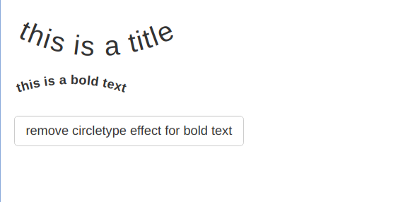
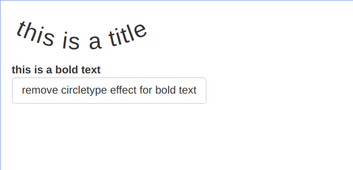

# circletyper

<!-- badges: start -->

[](https://github.com/etiennebacher/circletyper/actions)
<!-- badges: end -->

The goal of `{circletyper}` is to enable text curving in Shiny apps, by adapting
[CircleType.js](https://github.com/peterhry/CircleType) into R.

## Installation

For now, you can only install the development version of
`{circletyper}`:

```{r eval = FALSE}
# install.packages("devtools")
devtools::install_github("etiennebacher/circletyper")
```

## Example

```{r eval = FALSE}
library(shiny)
library(magrittr)
library(circletyper)

ui <- fluidPage(
  use_circletype(), # load dependencies

  # Wrap the text element you want to curve into circletype()...
  circletype(h2("this is a title", id = "testh2"), dir = -1, radius = 200),

  # ... or use magrittr's pipe
  strong("this is a bold text", id = "teststrong") %>% circletype(dir = 1),

  br(),

  actionButton("remove", "remove circletype effect")
)

server <- function(input, output, session) {

  # You can also remove the circletype effect
  observeEvent(input$remove, {
    remove_circletype("teststrong")
  })

}

shinyApp(ui, server)
```

| Initial              | After clicking on the button |
  | -------------------- | ---------------------------- |
  |  |           |
